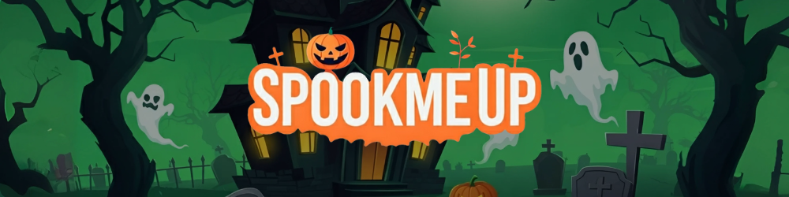

[](https://spookmeup.com)

# SpookMeUp

Making and sharing scary selfmade sounds for games, music, or just freaking out your friends.
Jump in and SpookTHEMUp! 👻

### Table of Contents

-   🚀 [Getting Started](#getting-started)

---

## <a name="getting-started">🚀 Getting Started</a>

Use the following commands to run the project locally:

```bash
git clone https://github.com/georgekarapi/spookmeup
cd spookmeup
npm i
npm run dev
```
